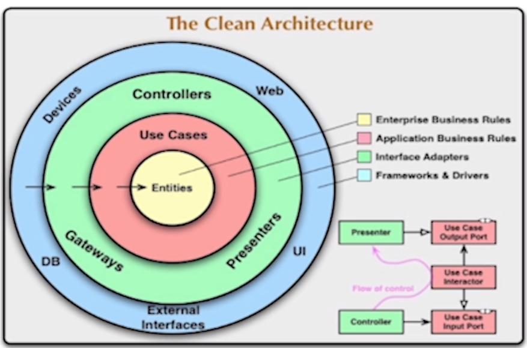
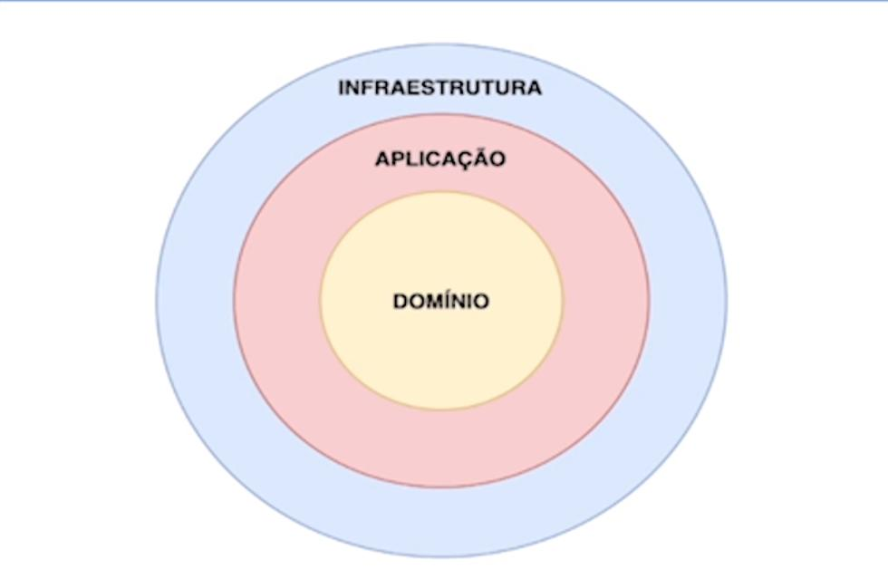

# alura-architecture-java
Introduction to clean architecture 

## Which is?
Este projeto tem o objetivo de mostrar um simples modelo de  arquitetura limpa, onde será feito matricula de alunos, cadastrar telefones dos alunos e indicação de alunos, entre outros.

## Frameworks / Tecnologias
- Java 11
- Maven 3
- Eclipse

## Clean Architecture Diagram


## Vantagens
- Isolar o código de domínio da aplicação
- Inversão de dpendências
- Favorece boas práticas de orientação a objetos
- Código de domínio com alta "testabilidade"
- Independência de frameworks e detalhes de infraestrutura

## Diferença entre Entidade e VO
Entidades possuem uma identidade única, enquanto VOs são considerados iguais, se todos os seus atributos tiverem valores iguais.

> Ex: Se dois e-mails possuem o mesmo endereço, podemos considerá-los como o mesmo e-mail. Já duas pessoas com o nome, altura e idade não necessariamente são a mesma pessoa. 

## Modelo de arquitetura da aplicação


Qual a ordem em que as dependências deveriam acontecer nas camadas de um projeto?
>Sempre para dentro (camadas de fora podem depender das de dentro)
```text
Assim, o nosso domínio (camada mais interna) é independente de qualquer detalhe exterior. Nossa aplicação depende apenas do nosso domínio, e não conhece detalhes de infraestrutura. A camada de infraestrutura apoia as camadas mais interiores.

Ao desenvolver um sistema complexo, o domínio deve ser o foco. Por isso, ele é a camada central dos padrões de arquitetura.

O conceito de modelarmos a nossa aplicação pensando primeiramente no domínio é chamado de Domain Driven Design, ou design orientado a domínio.
```